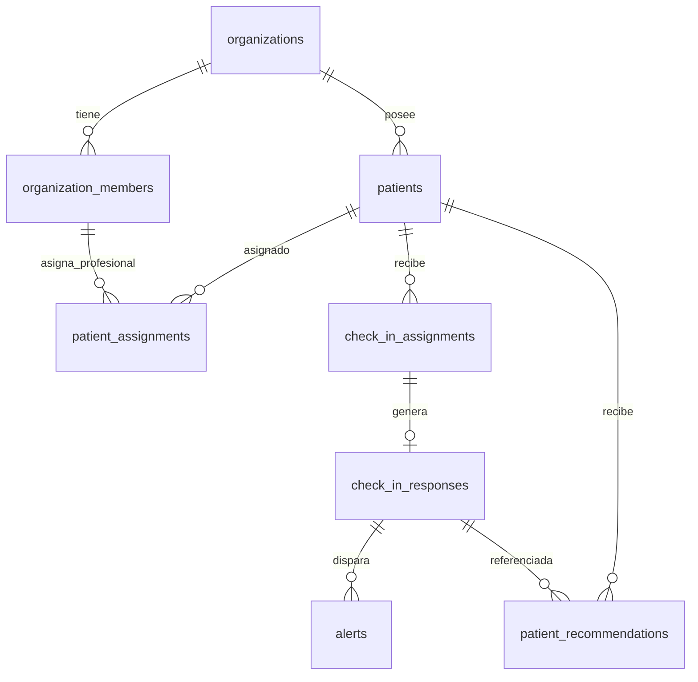

# Modelo de Datos — NutriSoft (Fase 2.1)

## 📊 Tablas y Relaciones Multi-Tenant

### Invariantes Principales (Fase 2.1):
- **FK Compuesta de Recomendaciones:** `fk_recommendations_response_composite` `(organization_id, patient_id, response_id)` -> `check_in_responses(organization_id, patient_id, id)` `ON DELETE RESTRICT`.
- **FK Compuesta de Asignaciones Profesionales:** `fk_patient_assignments_member_composite` `(organization_id, nutritionist_user_id)` -> `organization_members(organization_id, user_id)` `ON DELETE RESTRICT`.
- **Triggers de Integridad:**
  - `app.verify_patient_assignment_member()` exige rol activo `nutritionist` u `owner`.
  - `app.prevent_member_mutation_with_active_assignments()` impide degradar o desactivar miembros con asignaciones clínicas activas.
- **Inmutabilidad Absoluta:** `check_in_responses` y `audit_logs` poseen triggers `FOR EACH STATEMENT` que bloquean todo `UPDATE` o `DELETE`.
