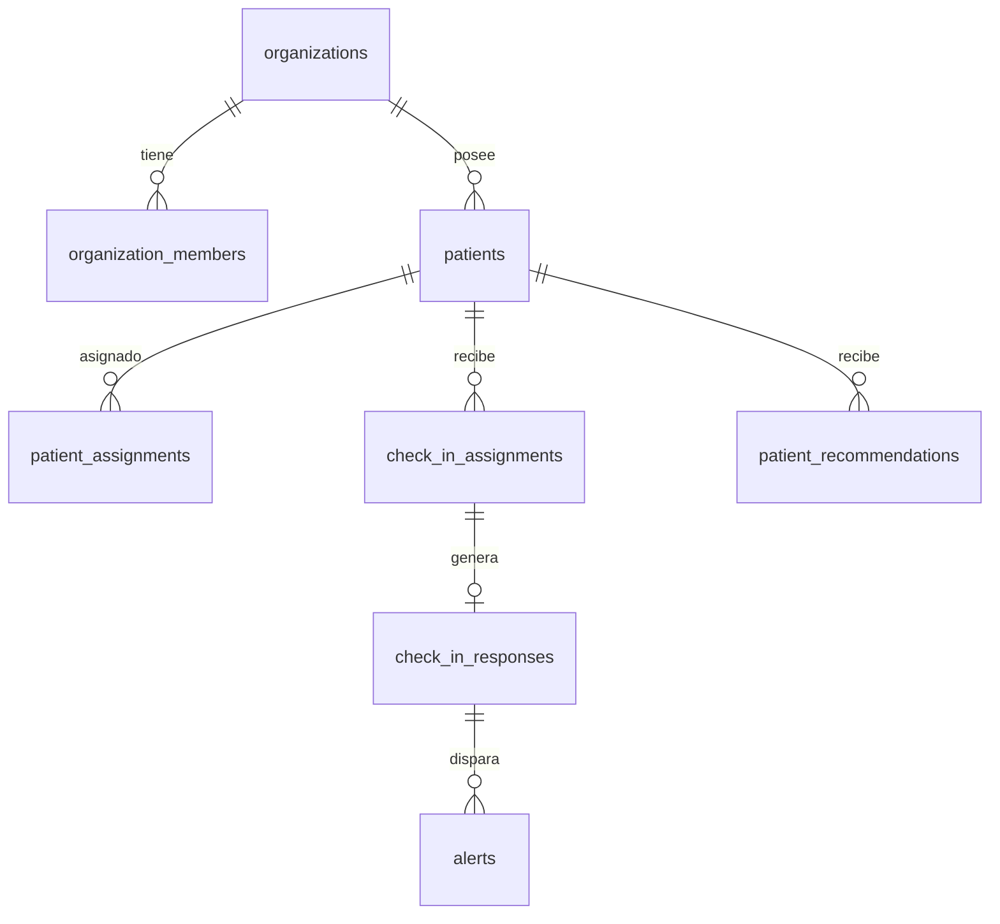

# Modelo de Datos — NutriSoft (Fase 2)

## 📊 Tablas y Relaciones Multi-Tenant

### Invariantes Principales:
- `organization_id` está presente en todas las tablas clínicas para reforzar el aislamiento a nivel de base de datos con claves foráneas compuestas.
- Las respuestas `check_in_responses` y los registros `audit_logs` son **inmutables** (no permiten UPDATE ni DELETE).
