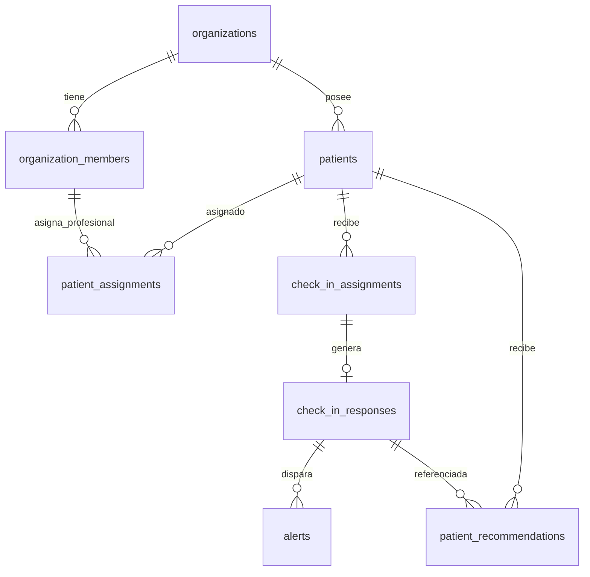

# Modelo de Datos — NutriSoft (Fase 2.1)

## 📊 Tablas y Relaciones Multi-Tenant

### Invariantes Principales (Fase 2.1):
- **FK Compuesta de Recomendaciones:** `fk_recommendations_response_composite` `(organization_id, patient_id, response_id)` -> `check_in_responses(organization_id, patient_id, id)` `ON DELETE RESTRICT`.
- **FK Compuesta de Asignaciones Profesionales:** `fk_patient_assignments_member_composite` `(organization_id, nutritionist_user_id)` -> `organization_members(organization_id, user_id)` `ON DELETE RESTRICT`.
- **Triggers de Integridad:**
  - `app.verify_patient_assignment_member()` exige rol activo `nutritionist` u `owner`.
  - `app.prevent_member_mutation_with_active_assignments()` impide degradar o desactivar miembros con asignaciones clínicas activas.
- **Inmutabilidad Absoluta:** `check_in_responses` y `audit_logs` poseen triggers `FOR EACH STATEMENT` que bloquean todo `UPDATE` o `DELETE`. Los UUID históricos `actor_id` y `organization_id` del log no usan claves foráneas: así sobreviven a la baja de la entidad original sin que PostgreSQL intente mutar la evidencia mediante `ON DELETE SET NULL`.

### Planes alimentarios individuales — implementado localmente

- `meal_plans` conserva autor, tenant, título, estado y `bound_patient_id` permanente.
- `meal_plan_versions` conserva snapshots JSON validados; sólo un borrador y una versión publicada por plan. Una versión publicada es inmutable salvo su transición a reemplazada.
- `meal_plan_assignments` es única por plan y permite un principal y un complemento activos por paciente. Una asignación pendiente no desplaza la activa hasta publicar.
- `meal_plan_meal_activity` relaciona organización, paciente, asignación, plan, día y comida; conserva cumplimiento, último comentario opcional y revisión actual.
- Duplicar genera otro plan, sin paciente ni asignación, y nuevos identificadores de día, comida y elemento.
- Comentarios, cumplimiento y revisiones requieren autorización contextual y aislamiento multi-tenant; no están disponibles para Platform Admin, owner no clínico ni assistant. El cumplimiento y las asignaciones sí generan auditoría; el contenido anterior de comentarios no.
- Retirar un plan elimina su visibilidad para el paciente, no el registro interno autorizado. La reasignación profesional revoca acceso anterior y no copia contenido clínico sin transferencia explícita.
